# Grazioso Rescue Finder

- [Grazioso Rescue Finder](#grazioso-rescue-finder)
  - [About the Project](#about-the-project)
  - [Motivation](#motivation)
  - [CRUD Operations](#crud-operations)
    - [Create Operation](#create-operation)
    - [Read Operation](#read-operation)
    - [Update Operation](#update-operation)
    - [Delete Operation](#delete-operation)
  - [Why PyMongo?](#why-pymongo)
  - [Getting Started](#getting-started)
  - [Quick Start](#quick-start)
  - [Installation](#installation)
    - [Required Tools](#required-tools)
    - [Installation Commands](#installation-commands)
  - [Usage](#usage)
    - [Code Example](#code-example)
    - [Tests](#tests)
    - [Screenshots](#screenshots)
      - [Module Setup and Import](#module-setup-and-import)
      - [Test Data Setup](#test-data-setup)
      - [Creation Operation – Valid data and None Data](#creation-operation--valid-data-and-none-data)
      - [Creation Operation – Duplicate Entry Handling and Empty Animal ID](#creation-operation--duplicate-entry-handling-and-empty-animal-id)
      - [Creation Operation – Handling Empty Object](#creation-operation--handling-empty-object)
      - [Read Operation – Find Record](#read-operation--find-record)
      - [Read Operation – Empty Result](#read-operation--empty-result)
      - [Read Operation – Error Handling](#read-operation--error-handling)
      - [Update Operation with Valid Query and Update Data (Explicit $set)](#update-operation-with-valid-query-and-update-data-explicit-set)
      - [Update Operation without Operator (Auto-wrap in $set)](#update-operation-without-operator-auto-wrap-in-set)
      - [Update Operation with None Query (Error Handling Test)](#update-operation-with-none-query-error-handling-test)
      - [Update Operation with None Update Data (Error Handling Test)](#update-operation-with-none-update-data-error-handling-test)
      - [Update Operation with Non-Matching Query (No Documents Modified)](#update-operation-with-non-matching-query-no-documents-modified)
      - [Delete Operation with Valid Query](#delete-operation-with-valid-query)
      - [Delete Operation with None Query (Error Handling Test)](#delete-operation-with-none-query-error-handling-test)
      - [Delete Operation with Non-Matching Query (No Documents Deleted)](#delete-operation-with-non-matching-query-no-documents-deleted)
      - [Delete Multiple Documents](#delete-multiple-documents)
      - [Test Teardown - Cleanup Test Data](#test-teardown---cleanup-test-data)
  - [Roadmap/Features (Optional)](#roadmapfeatures-optional)
  - [Contact](#contact)

## About the Project

This application streamlines the identification of rescue dog candidates for Grazioso Salvare by providing database-driven search and categorization tools. Using Austin Animal Center shelter data, the system filters dogs by age, breed, and rescue specialization (water, mountain, disaster, tracking) through a Python/MongoDB backend and interactive web dashboard.

## Motivation

Grazioso Salvare needs an efficient way to identify dogs with the right characteristics for search-and-rescue training from thousands of shelter animals across the Austin area. Manual review of shelter records is time-consuming and inconsistent. This system automates the candidate identification process, enabling trainers to quickly locate dogs that match specific rescue profiles—ultimately getting more qualified animals into life-saving training programs faster while giving shelter dogs a second chance at purposeful work.

## CRUD Operations

The CRUD Python module provides four essential database operations for managing animal shelter data:

### Create Operation

- **Purpose**: Insert new animal records into the MongoDB database
- **Method**: `create(data: dict) -> bool`
- **Returns**: `True` on successful insertion, `False` on failure
- **Features**:
  - Validates required `animal_id` field
  - Prevents duplicate entries
  - Comprehensive error handling

### Read Operation

- **Purpose**: Query and retrieve animal records from the database
- **Method**: `read(query: dict) -> list`
- **Returns**: List of matching documents, empty list if none found
- **Features**:
  - Flexible query filtering
  - Returns all matching documents
  - Proper cursor handling for efficient memory usage

### Update Operation

- **Purpose**: Modify existing animal records in the database
- **Method**: `update(query: dict, update_data: dict) -> int`
- **Returns**: Number of modified documents (modified_count)
- **Features**:
  - Auto-wraps update data in `$set` if no operator provided
  - Supports all MongoDB update operators ($set, $inc, $push, etc.)
  - Returns 0 on error or if no documents modified

### Delete Operation

- **Purpose**: Remove animal records from the database
- **Method**: `delete(query: dict) -> int`
- **Returns**: Number of deleted documents (deleted_count)
- **Features**:
  - Removes all documents matching query criteria
  - Returns 0 on error or if no documents deleted
  - Safe deletion with query validation

## Why PyMongo?

PyMongo was selected as the database driver for this project for the following reasons:

1. **Official MongoDB Support**: PyMongo is the official MongoDB driver for Python, ensuring reliable compatibility and long-term support.

2. **Comprehensive Feature Set**: Provides complete access to MongoDB's CRUD operations, aggregation framework, and advanced query capabilities.

3. **Pythonic API**: Offers intuitive, Python-native interface that follows familiar dictionary and list patterns for working with documents.

4. **Performance**: Implements connection pooling and efficient cursor management for optimal database performance.

5. **Active Development**: Regular updates and maintenance from MongoDB Inc. ensure compatibility with latest MongoDB versions and Python releases.

6. **Industry Standard**: Widely adopted in production environments with extensive documentation and community support.

## Getting Started

To get a local copy of this CRUD module up and running, follow these simple steps:

1. Prerequisites
    Before you begin, ensure you have completed the following setup requirements:

    1. MongoDB Installation: MongoDB Community Edition installed and running on localhost:27017
    2. Python Environment: Python 3.13+ with pip package manager
    3. Database Setup: AAC database imported with proper authentication

2. Database Setup

    1. Import the AAC Dataset:

        ```bash
        cd ./datasets
        mongoimport --type=csv --headerline --db aac --collection animals --drop ./aac_shelter_outcomes.csv
        ```

    2. Create Database User:

        ```bash
        mongosh
        use admin
        db.createUser({
            user: "aacuser",
            pwd: passwordPrompt(),
            roles: [{role: "readWrite", db: "aac"}]
            });
        ```

    3. Verify Connection:

        ```bash
        db.runCommand({connectionStatus:1});
        ```

## Quick Start

1. Download the CRUD_Python_Module.py, requirements.txt and ProjectOneTestScript.ipynb files to your local development environment
2. Install required dependencies:

    ```bash
        pip3 install -r requirements.txt
    ```

3. Start Jupyter Notebook:

    ```bash
    jupyter notebook
    ```

4. Double click on the ProjectOneTestScript.ipynb and run all the cells in order.

That's it! You now have a working CRUD module ready for animal shelter data operations.

## Installation

The following tools and libraries are required to use this CRUD Python module:

### Required Tools

- Python 3 (Version 3.13 or higher)
  - Rationale: Core programming language providing object-oriented programming capabilities and extensive library support
  - Installation: Download from python.org or use system package manager

- PyMongo (Latest stable version)
  - Rationale: Official MongoDB driver for Python, providing comprehensive database operation support and connection management
  - Installation: pip3 install pymongo

- MongoDB (Version 8 or higher)
  - Rationale: Document-oriented database system ideal for flexible data storage and retrieval of animal shelter records
  - Installation: Download MongoDB Community Edition from mongodb.com

- Jupyter Notebook (Latest version)
  - Rationale: Interactive development environment enabling iterative testing and documentation of CRUD operations
  - Installation: pip3 install jupyter

### Installation Commands

```bash
# Create a virtual environment
python3 -m venv  .venv            # macos or linux
python -m venv .venv.             # windows

# Activate the virtual environment
source .venv/bin/activate.        # macos or linux
.\.venv\Scripts\Activate.ps1.     # windows (PowerShell)
.venv\Script\activate.bat.        # windows (cmd.exe)

# Install project requirements
pip3 install -r requirements.txt

# Verify MongoDB is running
mongosh --eval "db.runCommand('ismaster')"
```

## Usage

This section demonstrates how the CRUD Python module works and provides examples of its functionality.

### Code Example

```python
# Import the CRUD module
from CRUD_Python_Module import AnimalShelter

# Instantiate the AnimalShelter class
shelter = AnimalShelter()

# Example: Create a new animal record
new_animal = {
    "rec_num": "99999",
    "age_upon_outcome": "2 years",
    "animal_id": "TestID001",
    "animal_type": "Dog",
    "breed": "Labrador Retriever Mix",
    "color": "Golden/White",
    "date_of_birth": "2021-06-15",
    "datetime": "2023-06-20 14:30:00",
    "monthyear": "2023-06-20T14:30:00",
    "name": "TestDog",
    "outcome_subtype": "",
    "outcome_type": "Adoption",
    "sex_upon_outcome": "Neutered Male",
    "location_lat": 30.2672,
    "location_long": -97.7431,
    "age_upon_outcome_in_weeks": 104.0
}

# Insert the new record
create_result = shelter.create(new_animal)
print(f"Create operation successful: {create_result}")

# Example: Read animal records
# Query for all dogs
query_dogs = {"animal_type": "Dog"}
dog_results = shelter.read(query_dogs)
print(f"Found {len(dog_results)} dog records")

# Query for a specific animal by animal_id
query_id = {"animal_id": "TestID001"}
id_results = shelter.read(query_id)
print(f"Found {len(id_results)} matching record(s)")

# Example: Update animal records
# Update a single field
update_count = shelter.update(
    {"animal_id": "TestID001"},
    {"outcome_type": "Adoption"}
)
print(f"Updated {update_count} record(s)")

# Update with explicit $set operator
update_count = shelter.update(
    {"animal_id": "TestID001"},
    {"$set": {"location_lat": 30.2672}}
)
print(f"Updated {update_count} record(s)")

# Example: Delete animal records
# Delete a single record by animal_id
delete_count = shelter.delete({"animal_id": "TestID001"})
print(f"Deleted {delete_count} record(s)")

# Delete multiple records by criteria
delete_count = shelter.delete({"outcome_type": "Transfer"})
print(f"Deleted {delete_count} transfer record(s)")
```

### Tests

Testing for this CRUD module is performed using both:
1. **Unit Tests** - Python unittest suite in `tests/` directory (recommended for development)
2. **Interactive Tests** - ProjectOneTestScript.ipynb Jupyter Notebook (for demonstration)

#### Running Unit Tests

The project includes a comprehensive unittest suite with 29 tests covering all CRUD operations:

**With Live MongoDB Database (default):**
```bash
# Requires MongoDB running on localhost:27017 with aacuser credentials

# Run all tests
python -m unittest discover -s tests -p "test_*.py"

# Run with verbose output
python -m unittest discover -s tests -p "test_*.py" -v

# Run specific test file
python -m unittest tests.test_crud

# Run specific test class
python -m unittest tests.test_crud.TestCreate

# Run specific test method
python -m unittest tests.test_crud.TestCreate.test_create_with_valid_data
```

**With Mock Database (for CI/offline testing):**
```bash
# No MongoDB connection required - uses mocked database

# Run all tests with mock
USE_MOCK_DB=true python -m unittest discover -s tests -p "test_*.py"

# Run with verbose output
USE_MOCK_DB=true python -m unittest discover -s tests -p "test_*.py" -v
```
*Note: Mock database testing is currently in development. All 29 tests pass with live MongoDB.*

**Test Structure:**
- `tests/test_crud.py` - All CRUD operation tests (17 tests: Create, Read, Update, Delete)
- `tests/test_authentication.py` - Authentication and connection tests (4 tests)
- `tests/test_error_handling.py` - Error handling and edge case tests (8 tests)
- `tests/fixtures/test_data.py` - Shared test data and base test classes

**Total: 29 tests, all passing**

**Test Coverage:**
```bash
# Run tests with coverage analysis
pip install coverage
coverage run -m unittest discover -s tests -p "test_*.py"
coverage report -m CRUD_Python_Module.py

# Generate HTML coverage report
coverage html
# Open htmlcov/index.html in browser
```

**Current Coverage: 77%** of CRUD_Python_Module.py

### Code Quality & Linting

This project uses **ruff** for fast Python linting and code quality checks.

**Running the linter:**
```bash
# Check all Python files for issues
ruff check .

# Check specific files
ruff check CRUD_Python_Module.py tests/

# Auto-fix issues where possible
ruff check --fix .

# Show detailed output
ruff check --output-format=full .
```

**Linting Configuration:**
- Configuration file: `ruff.toml`
- Target: Python 3.13
- Line length: 79 characters (PEP 8)
- Enabled rules: pycodestyle, pyflakes, isort, pep8-naming, pyupgrade, flake8-bugbear

**Pre-commit checks:**
```bash
# Run linter before committing
ruff check .

# Run tests before committing
python -m unittest discover -s tests -p "test_*.py"
```

#### Interactive Test Script Example

```python
# Import the CRUD module
from CRUD_Python_Module import AnimalShelter

# Instantiate an instance of the class
shelter = AnimalShelter()

# Test Create functionality - insert a new record
test_animal = {
    "animal_id": "TEST001",
    "name": "Test Animal",
    "animal_type": "Dog", 
    "breed": "Test Breed",
    "age_upon_outcome": "2 years"
}

create_result = shelter.create(test_animal)
print(f"Create test result: {create_result}")

# Test Read functionality - query records
read_results = shelter.read({"animal_type": "Dog"})
print(f"Read test found {len(read_results)} dog records")

# Test Update functionality - modify a record
update_count = shelter.update(
    {"animal_id": "TEST001"},
    {"outcome_type": "Adoption"}
)
print(f"Update test modified {update_count} record(s)")

# Test Delete functionality - remove a record
delete_count = shelter.delete({"animal_id": "TEST001"})
print(f"Delete test removed {delete_count} record(s)")
```

### Screenshots

#### Module Setup and Import


#### Test Data Setup

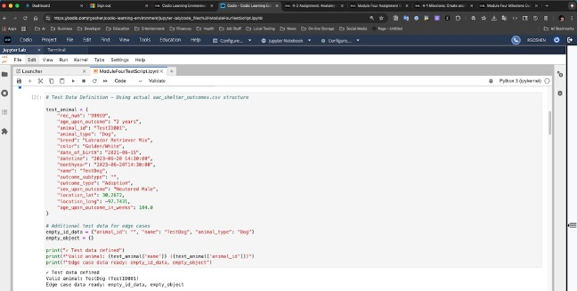

#### Creation Operation – Valid data and None Data

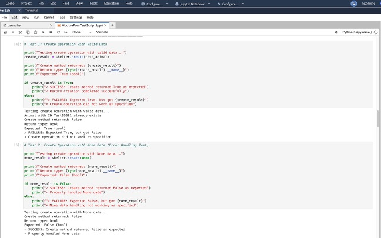

#### Creation Operation – Duplicate Entry Handling and Empty Animal ID

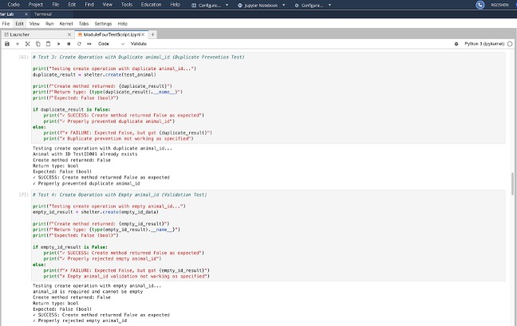

#### Creation Operation – Handling Empty Object

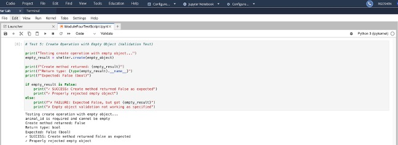

#### Read Operation – Find Record

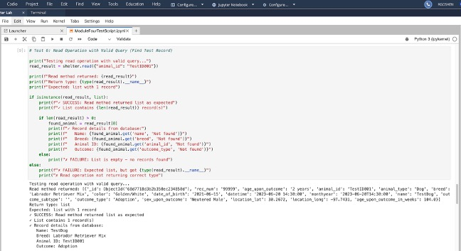

#### Read Operation – Empty Result

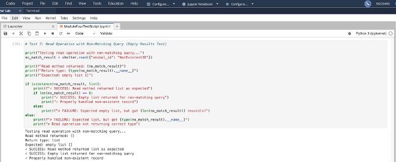

#### Read Operation – Error Handling

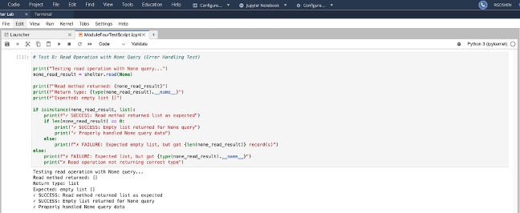

#### Update Operation with Valid Query and Update Data (Explicit $set)

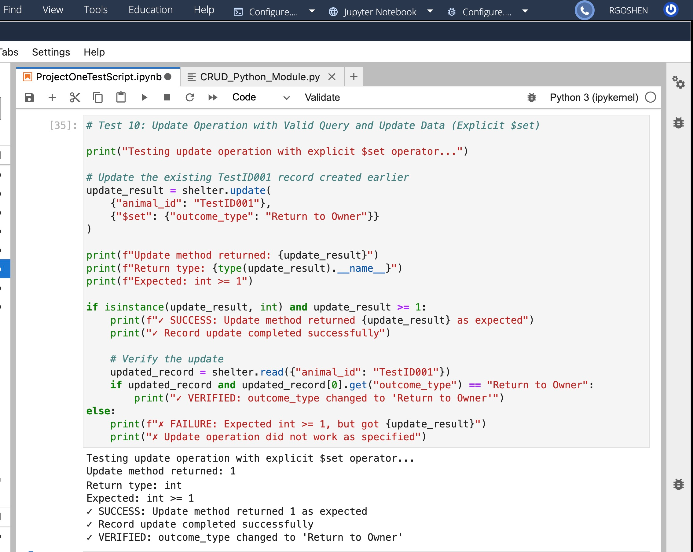

#### Update Operation without Operator (Auto-wrap in $set)


#### Update Operation with None Query (Error Handling Test)

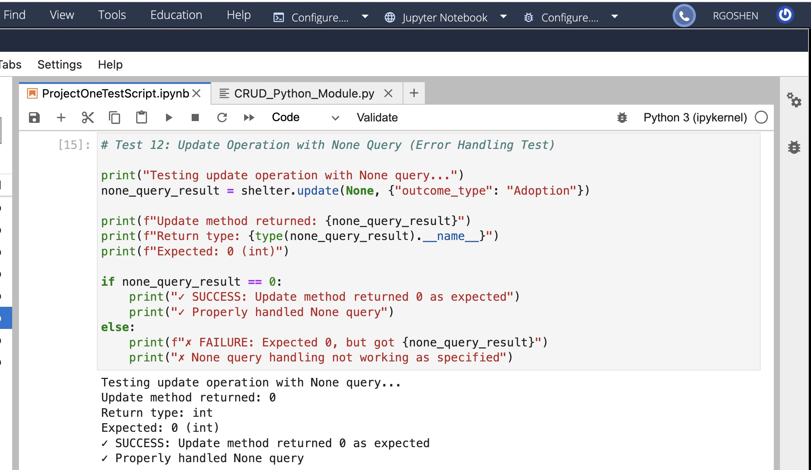

#### Update Operation with None Update Data (Error Handling Test)


#### Update Operation with Non-Matching Query (No Documents Modified)


#### Delete Operation with Valid Query

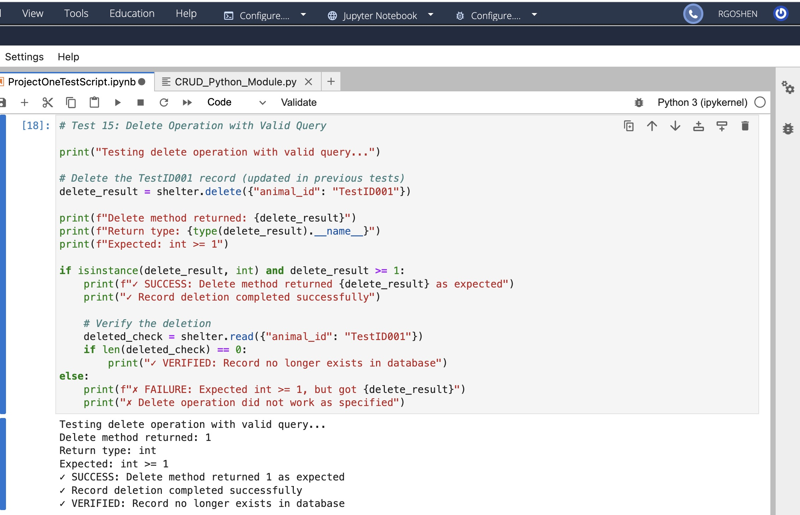

#### Delete Operation with None Query (Error Handling Test)

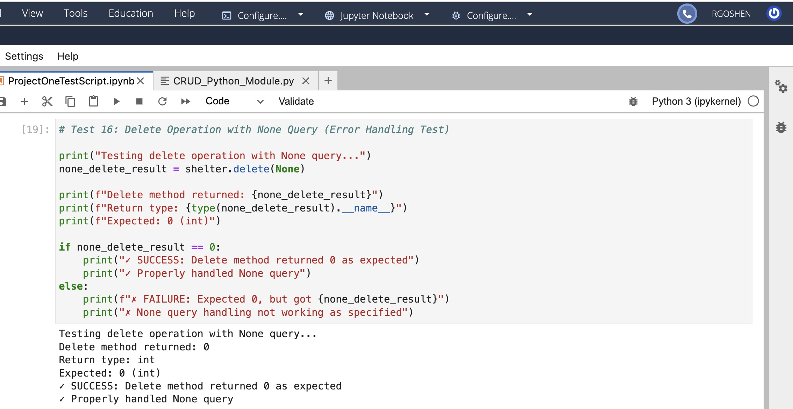

#### Delete Operation with Non-Matching Query (No Documents Deleted)

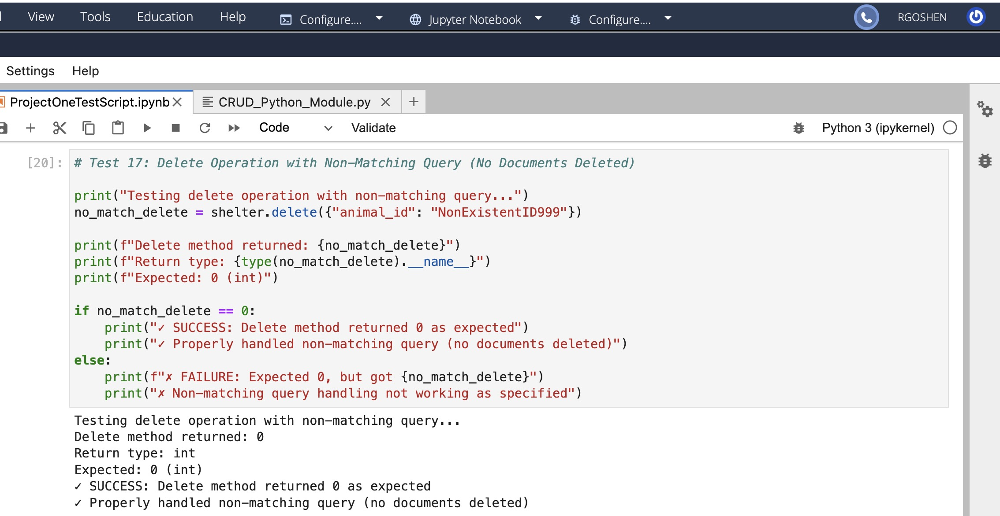

#### Delete Multiple Documents

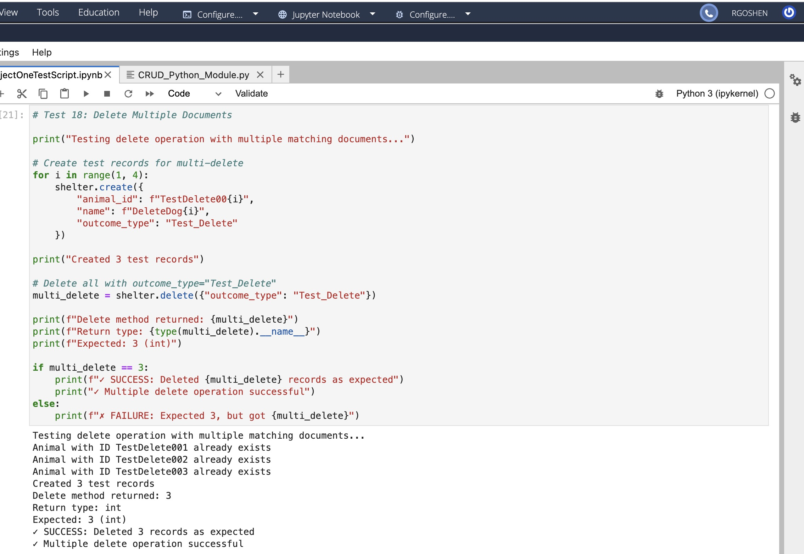

#### Test Teardown - Cleanup Test Data

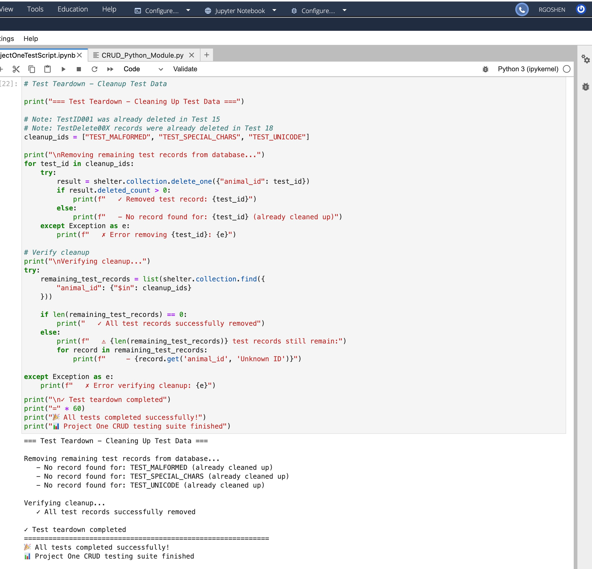

## Roadmap/Features

- Dashboard
  - Interactive data table
  - Geolocation chart

## Contact

Your name: Rick Goshen
Email: [richard.goshen@snhu.edu](mailto: richard.goshen@snhu.edu)
