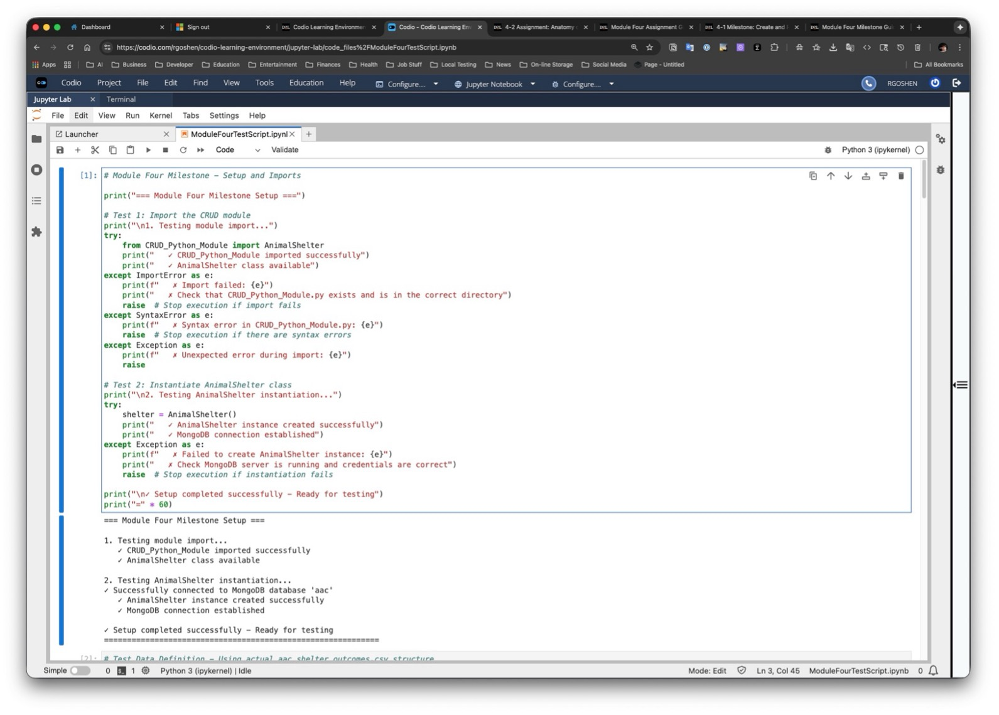

# Grazioso Rescue Finder

- [Grazioso Rescue Finder](#grazioso-rescue-finder)
  - [About the Project](#about-the-project)
  - [Motivation](#motivation)
  - [Getting Started](#getting-started)
  - [Quick Start](#quick-start)
  - [Installation](#installation)
    - [Required Tools](#required-tools)
    - [Installation Commands](#installation-commands)
  - [Usage](#usage)
    - [Code Example](#code-example)
    - [Tests](#tests)
    - [Screenshots](#screenshots)
      - [Module Setup and Import](#module-setup-and-import)
      - [Test Data Setup](#test-data-setup)
      - [Creation Operation – Valid data and None Data](#creation-operation--valid-data-and-none-data)
      - [Creation Operation – Duplicate Entry Handling and Empty Animal ID](#creation-operation--duplicate-entry-handling-and-empty-animal-id)
      - [Creation Operation – Handling Empty Object](#creation-operation--handling-empty-object)
      - [Read Operation – Find Record](#read-operation--find-record)
      - [Read Operation – Empty Result](#read-operation--empty-result)
      - [Read Operation – Error Handling](#read-operation--error-handling)
  - [Roadmap/Features (Optional)](#roadmapfeatures-optional)
  - [Contact](#contact)

## About the Project

This application streamlines the identification of rescue dog candidates for Grazioso Salvare by providing database-driven search and categorization tools. Using Austin Animal Center shelter data, the system filters dogs by age, breed, and rescue specialization (water, mountain, disaster, tracking) through a Python/MongoDB backend and interactive web dashboard.

## Motivation

Grazioso Salvare needed an efficient way to identify dogs with the right characteristics for search-and-rescue training from thousands of shelter animals across the Austin area. Manual review of shelter records was time-consuming and inconsistent. This system automates the candidate identification process, enabling trainers to quickly locate dogs that match specific rescue profiles—ultimately getting more qualified animals into life-saving training programs faster while giving shelter dogs a second chance at purposeful work.

## Getting Started

To get a local copy of this CRUD module up and running, follow these simple steps:

1. Prerequisites
    Before you begin, ensure you have completed the following setup requirements:

    1. MongoDB Installation: MongoDB Community Edition installed and running on localhost:27017
    2. Python Environment: Python 3.13+ with pip package manager
    3. Database Setup: AAC database imported with proper authentication

2. Database Setup

    1. Import the AAC Dataset:

        ```bash
        cd ./datasets
        mongoimport –type=csv –headliner –db aac –collection animals –drop ./aac_shelter_outcomes.csv
        ```

    2. Create Database User:

        ```bash
        mongosh
        use admin
        db.createUser({
            user: “aacuser”,
            pwd: paswordPrompt(),
            roles: [{role: “readWrite”, db: “aac”}]
            });
        ```

    3. Verify Connection:

        ```bash
        db.runCommand({connectionStatus:1});
        ```

## Quick Start

1. Download the CRUD_Python_Module.py, requirements.txt and ModuleFourTestScript.ipynb files to your local development environment
2. Install required dependencies:

    ```bash
        pip3 install -r requirements.txt
    ```

3. Start Jupyter Notebook:

    ```bash
    jupyter notebook
    ```

4. Double click on the ModuleFourTestScript.ipynb and run all the cells in order.

That's it! You now have a working CRUD module ready for animal shelter data operations.

## Installation

The following tools and libraries are required to use this CRUD Python module:

### Required Tools

- Python 3 (Version 3.13 or higher)
  - Rationale: Core programming language providing object-oriented programming capabilities and extensive library support
  - Installation: Download from python.org or use system package manager

- PyMongo (Latest stable version)
  - Rationale: Official MongoDB driver for Python, providing comprehensive database operation support and connection management
  - Installation: pip3 install pymongo

- MongoDB (Version 8 or higher)
  - Rationale: Document-oriented database system ideal for flexible data storage and retrieval of animal shelter records
  - Installation: Download MongoDB Community Edition from mongodb.com

- Jupyter Notebook (Latest version)
  - Rationale: Interactive development environment enabling iterative testing and documentation of CRUD operations
  - Installation: pip3 install jupyter

### Installation Commands

```bash
# Create a virtual environment
python3 -m venv  .venv  	# macos or linux
python -m venv .venv		# windows

# Activate the virtual environment
source .venv/bin/activate	# macos or linux
.\.venv\Scripts\Activate.ps1	# windows (PowerShell)
.venv\Script\activate.bat	# windows (cmd.exe)

# Install project requirements
pip3 install -r requirements.txt

# Verify MongoDB is running
mongosh --eval "db.runCommand('ismaster')"
```

## Usage

This section demonstrates how the CRUD Python module works and provides examples of its functionality.

### Code Example

```python
# Import the CRUD module
from CRUD_Python_Module import AnimalShelter

# Instantiate the AnimalShelter class
shelter = AnimalShelter()

# Example: Create a new animal record
new_animal = {
test_animal = {
    "rec_num": "99999",
    "age_upon_outcome": "2 years",
    "animal_id": "TestID001",
    "animal_type": "Dog",
    "breed": "Labrador Retriever Mix",
    "color": "Golden/White",
    "date_of_birth": "2021-06-15",
    "datetime": "2023-06-20 14:30:00",
    "monthyear": "2023-06-20T14:30:00",
    "name": "TestDog",
    "outcome_subtype": "",
    "outcome_type": "Adoption",
    "sex_upon_outcome": "Neutered Male",
    "location_lat": 30.2672,
    "location_long": -97.7431,
    "age_upon_outcome_in_weeks": 104.0
}
# Insert the new record
create_result = shelter.create(new_animal)
print(f"Create operation successful: {create_result}")

# Example: Read animal records
# Query for all dogs
query_dogs = {"animal_type": "Dog"}
dog_results = shelter.read(query_dogs)
print(f"Found {len(dog_results)} dog records")

# Query for a specific animal by name
query_name = {"name": "Buddy"}
name_results = shelter.read(query_name)
print(f"Animals named Buddy: {len(name_results)}")
```

### Tests

Testing for this CRUD module is performed using the provided ModuleFourTestScript.ipynb Jupyter Notebook. The testing approach follows the Module Four Milestone requirements:

Test Script Example:

```python
# Import the CRUD module
from CRUD_Python_Module import AnimalShelter

# Instantiate an instance of the class
shelter = AnimalShelter()

# Test Create functionality - insert a new record
test_animal = {
    "animal_id": "TEST001",
    "name": "Test Animal",
    "animal_type": "Dog", 
    "breed": "Test Breed",
    "age_upon_outcome": "2 years"
}

create_result = shelter.create(test_animal)
print(f"Create test result: {create_result}")

# Test Read functionality - query records
read_results = shelter.read({"animal_type": "Dog"})
print(f"Read test found {len(read_results)} dog records")

# Test with specific query
name_query = shelter.read({"name": "Test Animal"})
print(f"Found test animal: {len(name_query) > 0}")
```

### Screenshots

#### Module Setup and Import



#### Test Data Setup


#### Creation Operation – Valid data and None Data


#### Creation Operation – Duplicate Entry Handling and Empty Animal ID


#### Creation Operation – Handling Empty Object


#### Read Operation – Find Record


#### Read Operation – Empty Result


#### Read Operation – Error Handling


## Roadmap/Features (Optional)

*Provide an open issues list of proposed features (and known issues). If
you have ideas for releases in the future, it is a good idea to list
them in the README. What makes your project stand out?\
\
Note: This section is optional for the purposes of this assignment. If
you choose not to fill out this section, remove it from your final
README file.*

## Contact

Your name:
